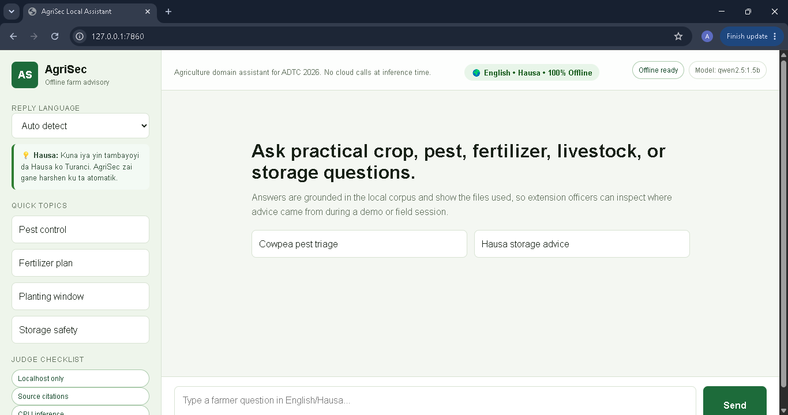
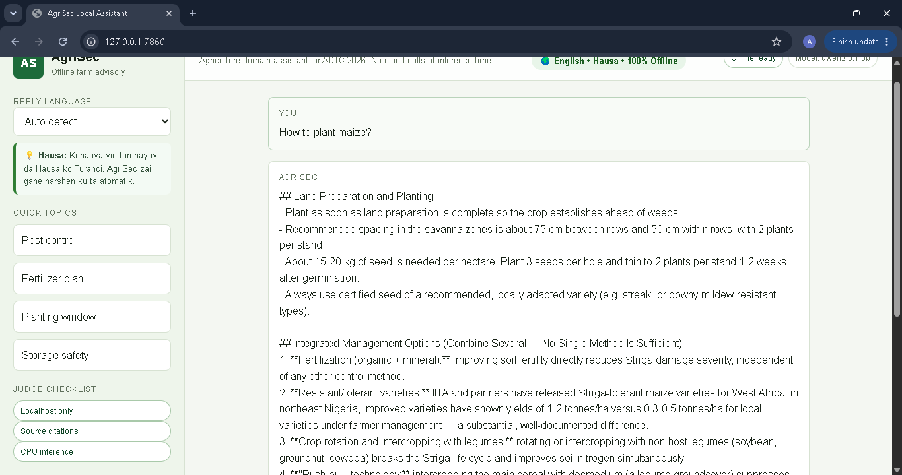
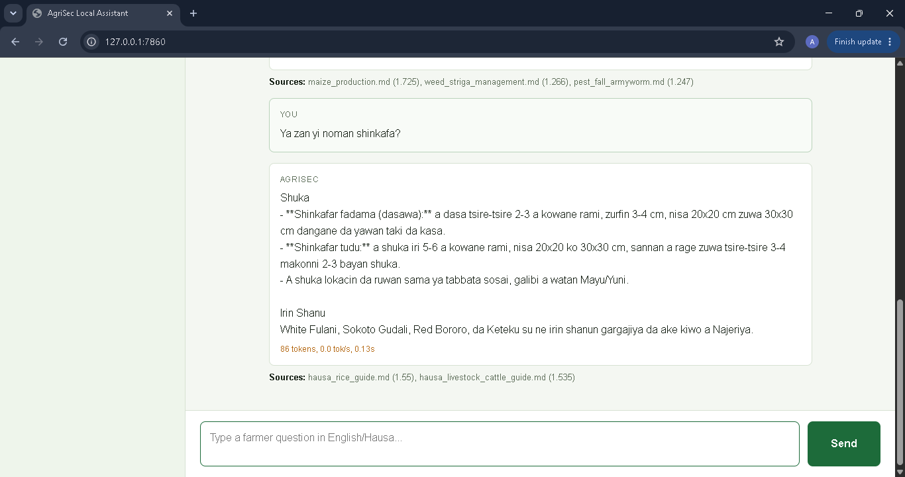
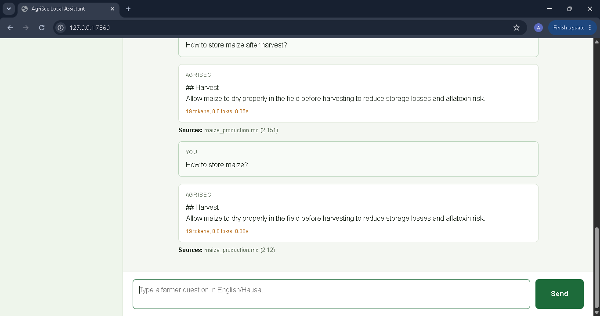
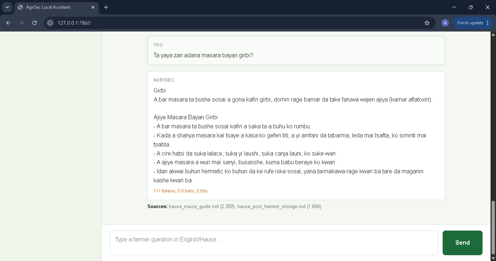
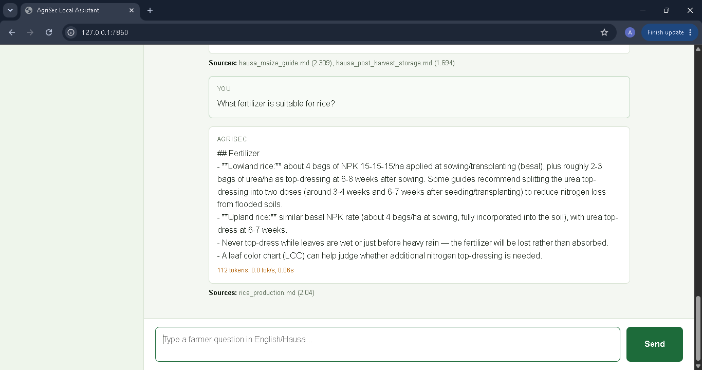
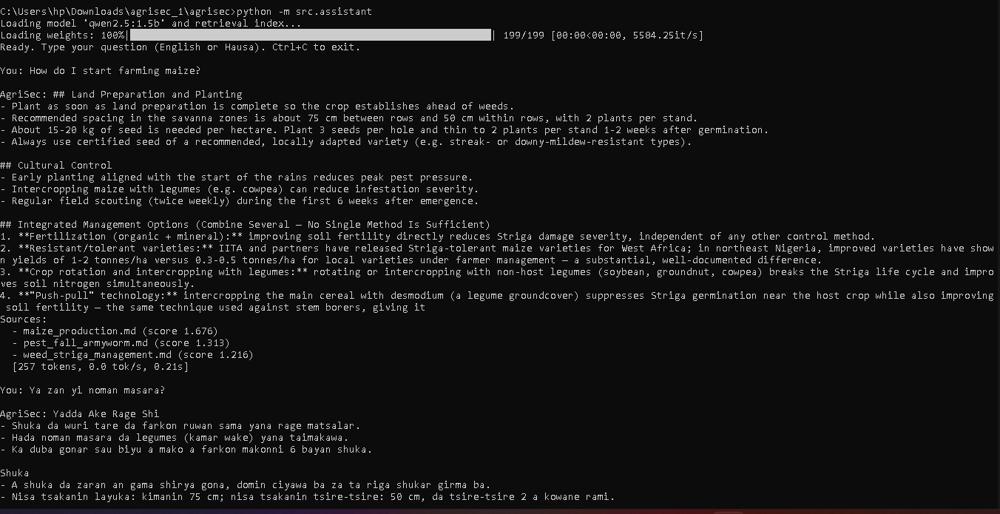
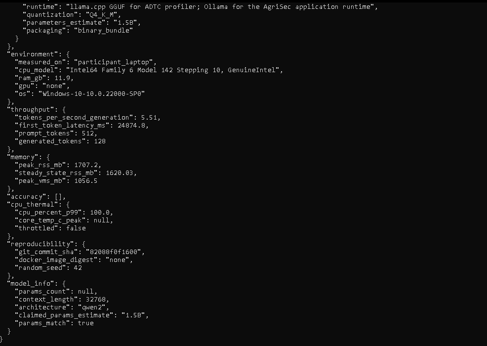

# 🌾 AgriSec

<div align="center">

## Offline AI Agricultural Assistant for African Farmers

**Africa Deep Tech Challenge (ADTC) 2026 Submission**

An AI-powered offline agricultural assistant that provides practical farming advice in **English** and **Hausa** using Retrieval-Augmented Generation (RAG), Qwen2.5, Ollama, and FAISS.

Designed to run entirely on budget laptops without requiring internet connectivity.


</div>

---

# 🌍 Overview

AgriSec is a fully offline Artificial Intelligence assistant built to help farmers across Africa access reliable agricultural knowledge even in areas without internet connectivity.

The project was developed for the **Africa Deep Tech Challenge (ADTC) 2026**, where the goal is to build AI systems capable of running efficiently on affordable laptops commonly used across Africa.

Unlike cloud-based AI assistants, AgriSec performs all inference locally using a lightweight language model and Retrieval-Augmented Generation (RAG). Farmers receive grounded, source-backed responses directly from a curated agricultural knowledge base.

---

# 🚜 The Problem

Millions of farmers across Africa face major barriers when trying to access agricultural information.

Some of these challenges include:

- Poor or unreliable internet connectivity
- Limited agricultural extension officers
- Language barriers
- High cost of cloud AI services
- Lack of locally relevant farming knowledge
- Difficulty obtaining trusted recommendations for crops, pests, fertilizers, livestock, and storage

Traditional AI assistants depend heavily on cloud APIs, making them inaccessible to many rural communities.

---

# 💡 Our Solution

AgriSec brings agricultural intelligence directly to the farmer's laptop.

Instead of sending questions to cloud servers, the system stores agricultural documents locally and retrieves the most relevant knowledge before generating an answer using a local Large Language Model.

The assistant supports both English and Hausa, making it accessible to a wider farming community.

Everything works completely offline.

---

# 🎯 Features

- ✅ Fully Offline AI Assistant
- ✅ English & Hausa Support
- ✅ Retrieval-Augmented Generation (RAG)
- ✅ Local Knowledge Base
- ✅ Source-backed Responses
- ✅ Conversation Memory
- ✅ Intelligent Language Detection
- ✅ Semantic Search with FAISS
- ✅ Lightweight Deployment
- ✅ Localhost Web Interface
- ✅ Command Line Interface
- ✅ Designed for 8GB Budget Laptops
- ✅ ADTC Profiler Compatible

---

# 🌱 Agricultural Topics Supported

AgriSec currently answers questions related to:

## Crops

- Maize
- Rice
- Tomato
- Onion
- Pepper
- Millet
- Sorghum
- Cassava
- Yam
- Soybean
- Cotton
- Groundnut

---

## Fertilizer

- NPK recommendations
- Urea application
- Organic manure
- Fertilizer schedules
- Micro-dosing

---

## Pests

- Fall Armyworm
- Stem Borers
- Aphids
- Striga
- Fruit Fly

---

## Livestock

- Poultry
- Goats
- Sheep
- General livestock management

---

## Post-Harvest

- Grain storage
- Aflatoxin prevention
- Drying
- Storage safety

---

# 🌍 Supported Languages

The assistant automatically detects the user's language.

Supported languages include:

- 🇬🇧 English
- 🇳🇬 Hausa

Example:

English

> How do I control Fall Armyworm?

Hausa

> Ta yaya zan kashe tsutsar Fall Armyworm?

---

# 🧠 System Architecture

```text
 Farmer Question
        │
        ▼
 Web UI / CLI
        │
        ▼
 Language Detection
        │
        ▼
 Conversation Memory
        │
        ▼
 Query Processing
        │
        ▼
 FAISS Semantic Search
        │
        ▼
 Agriculture Knowledge Base
        │
        ▼
 Ollama + Qwen2.5:1.5B
        │
        ▼
 Grounded AI Response
        │
        ▼
 Source Citations + Performance Metrics
```

---

# ⚙️ How It Works

1. A farmer asks a question in English or Hausa.
2. The system automatically detects the language.
3. Conversation memory determines whether this is a follow-up question.
4. The query is embedded using Sentence Transformers.
5. FAISS retrieves the most relevant agricultural documents.
6. The retrieved context is passed to Qwen2.5 running locally through Ollama.
7. The AI generates a grounded response.
8. Sources and performance information are displayed.

No cloud services are used during inference.

---

# 🛠 Technologies Used

## Programming

- Python 3.11

## Artificial Intelligence

- Ollama
- Qwen2.5:1.5B
- Retrieval-Augmented Generation (RAG)

## Retrieval

- FAISS
- Sentence Transformers

## Backend

- Python

## Frontend

- HTML
- CSS
- JavaScript

## Data Format

- Markdown Knowledge Base

## Benchmarking

- ADTC Profiler
- llama.cpp
- llama-bench

---

# 📂 Project Structure

```text
AgriSec/
│
├── assets/
│
├── data/
│   ├── corpus/
│   └── index/
│
├── reports/
│
├── scripts/
│
├── src/
│   ├── assistant.py
│   ├── inference.py
│   ├── rag.py
│   ├── web_app.py
│   └── prompts.py
│
├── metadata.json
├── requirements.txt
├── README.md
├── PLAN.md
└── ARCHITECTURE.md
```

---

# 🚀 Installation

Clone the repository

```bash
git clone https://github.com/Ambatogusau/AgriSec.git
```

Enter the project

```bash
cd AgriSec
```

Create a virtual environment

```bash
python -m venv venv
```

Windows

```bash
venv\Scripts\activate
```

Linux/macOS

```bash
source venv/bin/activate
```

Install dependencies

```bash
pip install -r requirements.txt
```

Download the local model

```bash
ollama pull qwen2.5:1.5b
```

Build the FAISS index

```bash
python -m src.rag --build
```
---

# ▶️ Running AgriSec

## Start the Web Application

```bash
python -m src.web_app --model qwen2.5:1.5b
```

Open your browser and visit:

```
http://127.0.0.1:7860
```

The application runs entirely on your local machine.

---

## Run the Command Line Assistant

```bash
python -m src.assistant --model qwen2.5:1.5b
```

---

 HEAD
# 📸 Screenshots
 
# 📸 Screenshots

### 1. Home Page



---

### 2. English Assistant Demo (Maize Farming)



---

### 3. Hausa Assistant Demo (Rice Farming)



---

### 4. English Post-Harvest Storage Advice



---

### 5. Hausa Post-Harvest Storage Advice



---

### 6. Rice Fertilizer Recommendation



---

### 7. Retrieval Debug Information

Shows language detection, topic detection, retrieved documents, selected sources, and relevance scores used to generate grounded responses.



---

### 8. ADTC Profiler Results

Official ADTC participant profiler showing model performance, throughput, memory usage, and offline execution metrics.


 
=======
# 💬 Example Questions

## English

- How do I start maize farming?
- Which fertilizer is best for rice?
- How can I control Fall Armyworm?
- How should I store maize after harvest?
- How do I start tomato farming?
- How do I raise healthy poultry?

---

## Hausa

- Yaya zan shuka masara?
- Wane taki ya dace da shinkafa?
- Ta yaya zan kashe tsutsar Fall Armyworm?
- Ta yaya zan adana masara bayan girbi?
- Yaya zan yi noman tumatir?
- Yaya zan kiwon kaji?

---

# 📊 ADTC Benchmark Results

The project was benchmarked using the official **Africa Deep Tech Challenge (ADTC) Profiler**.

| Metric | Result |
|---------|--------|
| Model | Qwen2.5 1.5B Instruct |
| Runtime | Ollama (Application) |
| Profiler Runtime | llama.cpp |
| Quantization | Q4_K_M |
| Context Length | 32768 |
| Generation Speed | **5.51 Tokens/sec** |
| Peak RAM Usage | **1707 MB** |
| Steady RAM Usage | **1620 MB** |
| CPU Usage (P99) | 100% |
| Thermal Throttling | None |
| Cloud Dependency | None |
| Offline Inference | ✅ Yes |

---

# 🖥️ ADTC Profiler

AgriSec has been tested using the official **ADTC Profiler**.

Benchmark command:

```bash
adtc-profiler run --submission . --mode participant --output submission.json --skip-accuracy
```

The benchmark measures:

- Generation speed
- Memory usage
- CPU utilization
- Thermal behavior
- Model information
- Reproducibility

Profiler output is stored in:

```
submission.json
```

---

# 📷 Screenshots

The repository includes screenshots demonstrating:

- Home page
- English conversation
- Hausa conversation
- Retrieval Debug
- Source citations
- Performance metrics
- ADTC Profiler
- Offline execution

Screenshots are available inside:

```
assets/
```

---
 3b6afcb (Final ADTC 2026 submission)

# 🎥 Demo Video

The demonstration video showcases:

- Offline execution
- English questions
- Hausa questions
- Retrieval-Augmented Generation
- Source-backed responses
- ADTC benchmark
- Local inference using Ollama

Video length:

**Under 2 minutes**


---

# 📈 Why AgriSec Fits ADTC

| ADTC Requirement | AgriSec |
|------------------|----------|
| Offline AI | ✅ |
| Runs on Budget Laptop | ✅ |
| Local Inference | ✅ |
| No Cloud APIs | ✅ |
| Open Source | ✅ |
| African Language | ✅ Hausa |
| Retrieval-Augmented Generation | ✅ |
| Agriculture Domain | ✅ |
| Benchmarked | ✅ |
| Local Knowledge Base | ✅ |

---

# 🔒 Privacy

AgriSec processes all user requests locally.

No farming questions, documents, or personal information are sent to external servers.

This makes the assistant suitable for:

- Rural communities
- Schools
- Extension workers
- NGOs
- Government agencies

---

# 🚀 Future Roadmap

Future versions of AgriSec will include:

- 🎤 Voice interaction
- 🛰️ Drone imagery integration
- 🌱 Soil analysis
- 🍃 Plant disease detection
- 🌦️ Offline weather prediction
- 🗺️ Farm mapping
- 📱 Android application
- 📡 IoT sensor integration
- 🤖 AI-powered crop recommendation
- 🪨 Mineral detection module
- 📷 Camera-based crop diagnostics

---

# 👨‍💻 Developer

## Abdullahi Badamasi

Founder & CEO  
**Ambato Digital Hub**

Computer Engineer | AI Developer | Software Engineer

Project developed for the **Africa Deep Tech Challenge (ADTC) 2026**.

GitHub:

https://github.com/Ambatogusau

---

# 🙏 Acknowledgements

Special thanks to:

- Africa Deep Tech Foundation
- Ollama
- Qwen Team
- llama.cpp
- FAISS
- Sentence Transformers
- Python Community

for providing the open technologies that made this project possible.

---

# 📄 License

This project is released under the **MIT License**.

See the LICENSE file for details.

---

<div align="center">

## 🌾 AgriSec

### Offline AI for African Agriculture

**Built for the Africa Deep Tech Challenge (ADTC) 2026**

Empowering farmers with reliable agricultural knowledge — anytime, anywhere, completely offline.

⭐ If you found this project useful, consider giving it a star on GitHub.

</div>
